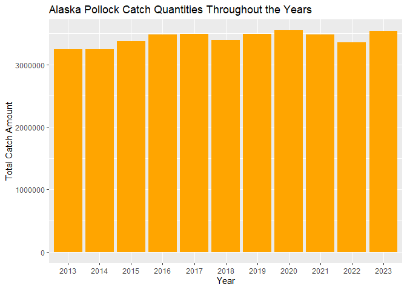
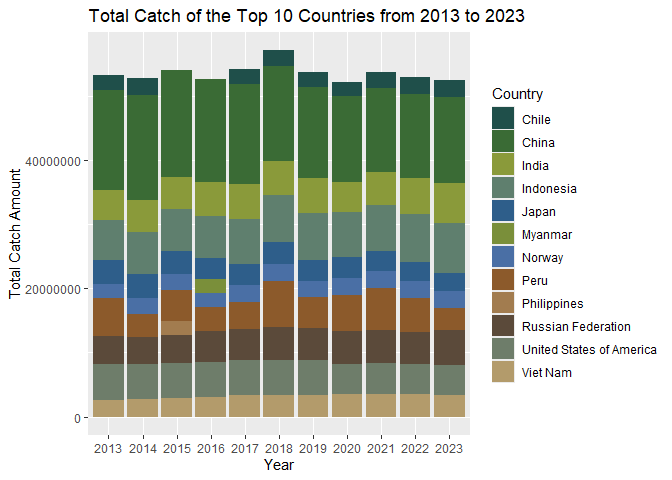

## Instructions
Answer the following questions and/or complete the exercises in RMarkdown. Please embed all of your code and push the final work to your repository. Your report should be organized, clean, and run free from errors. Remember, you must remove the `#` for any included code chunks to run.  

## Load the libraries

``` r
library("tidyverse")
library("janitor")
#library("naniar")
options(scipen = 999)
```

## About the Data
For this assignment we are going to work with a data set from the [United Nations Food and Agriculture Organization](https://www.fao.org/fishery/en/collection/capture) on world fisheries. These data were downloaded and cleaned using the `fisheries_clean.Rmd` script.  

Load the data `fisheries_clean.csv` as a new object titled `fisheries_clean`.

``` r
fisheries_clean <- read_csv("data/fisheries_clean.csv")
```

1. Explore the data. What are the names of the variables, what are the dimensions, are there any NA's, what are the classes of the variables, etc.? You may use the functions that you prefer.

``` r
glimpse(fisheries_clean)
```

```
## Rows: 1,055,015
## Columns: 9
## $ period          <dbl> 1950, 1951, 1952, 1953, 1954, 1955, 1956, 1957, 1958, …
## $ continent       <chr> "Asia", "Asia", "Asia", "Asia", "Asia", "Asia", "Asia"…
## $ geo_region      <chr> "Southern Asia", "Southern Asia", "Southern Asia", "So…
## $ country         <chr> "Afghanistan", "Afghanistan", "Afghanistan", "Afghanis…
## $ scientific_name <chr> "Osteichthyes", "Osteichthyes", "Osteichthyes", "Ostei…
## $ common_name     <chr> "Freshwater fishes NEI", "Freshwater fishes NEI", "Fre…
## $ taxonomic_code  <chr> "1990XXXXXXXX106", "1990XXXXXXXX106", "1990XXXXXXXX106…
## $ catch           <dbl> 100, 100, 100, 100, 100, 200, 200, 200, 200, 200, 200,…
## $ status          <chr> "A", "A", "A", "A", "A", "A", "A", "A", "A", "A", "A",…
```

2. Convert the following variables to factors: `period`, `continent`, `geo_region`, `country`, `scientific_name`, `common_name`, `taxonomic_code`, and `status`.

``` r
fisheries_clean <- fisheries_clean %>% 
  mutate(
    across(
      c(period, continent, geo_region, country, scientific_name, common_name, taxonomic_code, status), as.factor
    )
  )
```

#3. Are there any missing values in the data? If so, which variables contain missing values and how many are missing for each variable?


4. How many countries are represented in the data?

There are 249 countries represented in the data

``` r
fisheries_clean %>% 
  summarize(
    n = n_distinct(country)
  )
```

```
## # A tibble: 1 × 1
##       n
##   <int>
## 1   249
```

5. The variables `common_name` and `taxonomic_code` both refer to species. How many unique species are represented in the data based on each of these variables? Are the numbers the same or different?

There are 3390 unique common names and 3722 unique taxonomic codes, these numbers are not the same.


``` r
fisheries_clean %>% 
  summarize(
    common_name_n = n_distinct(common_name),
    tax_code_n = n_distinct(taxonomic_code)
  )
```

```
## # A tibble: 1 × 2
##   common_name_n tax_code_n
##           <int>      <int>
## 1          3390       3722
```

6. In 2023, what were the top five countries that had the highest overall catch?

China, Indonesia, India, the Russian Federation, and the United States of America had the highest overall catches in 2023.


``` r
fisheries_clean %>%
  filter(period == 2023) %>% 
  select(country, catch) %>%
  group_by(country) %>% 
  summarize(
    total_catch = sum(catch, na.rm = T)
  ) %>% 
  slice_max(total_catch, n = 5)
```

```
## # A tibble: 5 × 2
##   country                  total_catch
##   <fct>                          <dbl>
## 1 China                      13424705.
## 2 Indonesia                   7820833.
## 3 India                       6177985.
## 4 Russian Federation          5398032 
## 5 United States of America    4623694
```

7. In 2023, what were the top 10 most caught species? To keep things simple, assume `common_name` is sufficient to identify species. What does `NEI` stand for in some of the common names? How might this be concerning from a fisheries management perspective?

NEI stands for 'not elsewhere included' meaning that a category of fish was caught but the individual species were not individually identified. This would make it difficult to create accurate numbers of species and fish for inventory for fishery management.


``` r
fisheries_clean %>% 
  filter(period == 2023) %>% 
  select(period, common_name, catch) %>% 
  group_by(common_name) %>% 
  summarize(
    total_catch = sum(catch, na.rm = T)
  ) %>% 
  slice_max(total_catch, n = 10)
```

```
## # A tibble: 10 × 2
##    common_name                    total_catch
##    <fct>                                <dbl>
##  1 Marine fishes NEI                 8553907.
##  2 Freshwater fishes NEI             5880104.
##  3 Alaska pollock(=Walleye poll.)    3543411.
##  4 Skipjack tuna                     2954736.
##  5 Anchoveta(=Peruvian anchovy)      2415709.
##  6 Blue whiting(=Poutassou)          1739484.
##  7 Pacific sardine                   1678237.
##  8 Yellowfin tuna                    1601369.
##  9 Atlantic herring                  1432807.
## 10 Scads NEI                         1344190.
```

8. For the species that was caught the most above (not NEI), which country had the highest catch in 2023?

The Russian Federation caught the most Alaska Pollock which is the third most caught fish and the most caught fish excluding fish labeled with NEI.

``` r
fisheries_clean %>% 
  filter(common_name == "Alaska pollock(=Walleye poll.)") %>% 
  filter(period == 2023) %>% 
  select(country, catch) %>% 
  slice_max(catch, n = 1)
```

```
## # A tibble: 1 × 2
##   country              catch
##   <fct>                <dbl>
## 1 Russian Federation 1893580
```

9. How has fishing of this species changed over the last decade (2013-2023)? Create a  plot showing total catch by year for this species.

The total catch amount of the Alaska Pollock has slightly increased in the last decade, with some fluctuations throughout.


``` r
fisheries_clean %>% 
  filter(common_name == "Alaska pollock(=Walleye poll.)") %>% 
  filter(period %in% c(2013:2023)) %>%
  group_by(period) %>% 
  summarize(
    total_catch = sum(catch)
  ) %>% 
  ggplot(
    mapping=aes(
      x = period,
      y = total_catch,
    )
  )+
  geom_col(fill = "orange")+
  labs(
    title = "Alaska Pollock Catch Quantities Throughout the Years",
    x = "Year",
    y = "Total Catch Amount"
  )
```

<!-- -->

10. Perform one exploratory analysis of your choice. Make sure to clearly state the question you are asking before writing any code.

How have the top 10 countries by catch changed from 2013 to 2023?


``` r
country_palette <- c(
  "Chile" = "#1F4F4A",
  "China" = "#3A6B35",
  "India" = "#8A9A3A",
  "Indonesia" = "#5F7F6E",
  "Japan" = "#2E5E8A",
  "Myanmar" = "#7A8F3A",
  "Norway" = "#4A6FA5",
  "Peru" = "#8C5A2B",
  "Philippines" = "#A27C4F",
  "Russian Federation" = "#5B4A3A",
  "United States of America" = "#6E7D6A",
  "Viet Nam" = "#B39B6B"
)

fisheries_clean %>% 
  filter(period %in% c(2013:2023)) %>% 
  group_by(period, country) %>%
  summarize(
    total_catch = sum(catch)) %>%
  ungroup() %>% 
  group_by(period) %>% 
  slice_max(total_catch, n = 10) %>% 
  ggplot(
    mapping=aes(
      x=period,
      y=total_catch,
      fill=country
    )
  )+
  geom_col(position = 'stack')+
  scale_fill_manual(values = country_palette)+
  labs(
    title = "Total Catch of the Top 10 Countries from 2013 to 2023",
    x = "Year",
    y = "Total Catch Amount",
    fill = "Country"
  )
```

```
## `summarise()` has grouped output by 'period'. You can override using the
## `.groups` argument.
```

<!-- -->

## Knit and Upload
Please knit your work as an .html file and upload to Canvas. Homework is due before the start of the next lab. No late work is accepted. Make sure to use the formatting conventions of RMarkdown to make your report neat and clean!  
